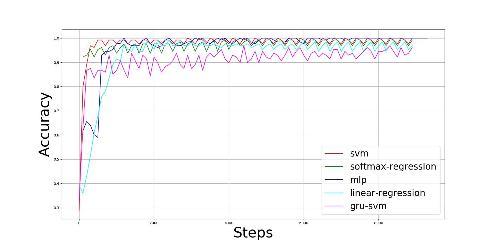

#WDBC-Classification-using-Feed-Forward-Neural-Network

## Results

All experiments were performed using PyCharm application on NVIDIA Tesla K40 GPU device.

**Figure 1. Training accuracy of the machine learning algorithms on breast cancer detection using WDBC.**

Figure 1 shows the training accuracy of the ML algorithms: (1) GRU-SVM finished its training in 2 minutes and 54
seconds with an average training accuracy of 90.6857639%, (2) Linear Regression finished its training in 35 seconds
with an average training accuracy of 92.8906257%, (3) MLP finished its training in 28 seconds with an average training
accuracy of 96.9286785%, (4) Softmax Regression finished its training in 25 seconds with an average training accuracy
of 97.366573%, and (5) L2-SVM finished its training in 14 seconds with an average training accuracy of 97.734375%.
There was no recorded training accuracy for Nearest Neighbor search since it does not require any training, as the norm
equations (L1 and L2) are directly applied on the dataset to determine the “nearest neighbor” of a given data
point p_{i} ∈ p.

 

**Table 1. Summary of experiment results on the machine learning algorithms.**

|Parameter|GRU-SVM|Linear Regression|MLP|L1-NN|L2-NN|Softmax Regression|L2-SVM|
|---------|-------|-----------------|---|-----|-----|------------------|------|
|Accuracy|93.75%|96.09375%|99.038449585420729%|93.567252%|94.736844%|97.65625%|96.09375%|
|Data points|384000|384000|512896|171|171|384000|384000|
|Epochs|3000|3000|3000|1|1|3000|3000|
|FP|16.666667%|10.204082%|1.267042%|6.25%|9.375%|5.769231%|6.382979%|
|FN|0|0|0.786157%|6.542056%|2.803738%|0|2.469136%|
|TP|100%|100%|99.213843%|93.457944%|97.196262%|100%|97.530864%|
|TN|83.333333%|89.795918%|98.732958%|93.75%|90.625%|94.230769%|93.617021%|

Table 1 summarizes the results of the experiment on the ML algorithms. The parameters recorded were test accuracy,
number of data points (`epochs * dataset_size`), epochs, false positive (FP) rate, false negative (FN) rate , true
positive (FP) rate, and true negative (TN) rate. All code implementations of the algorithms were written using Python
with TensorFlow as the machine learning library.

